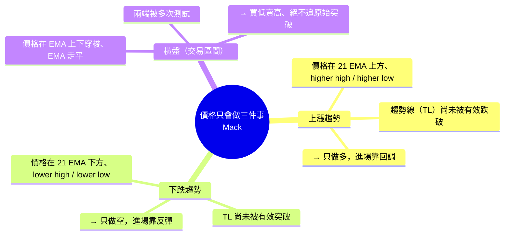
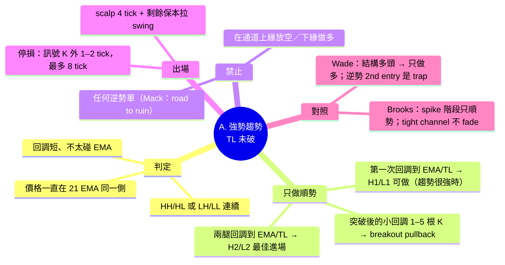
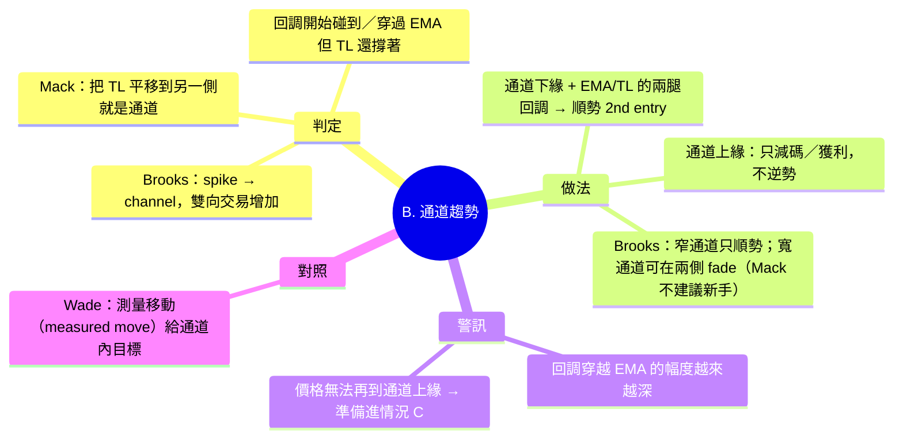
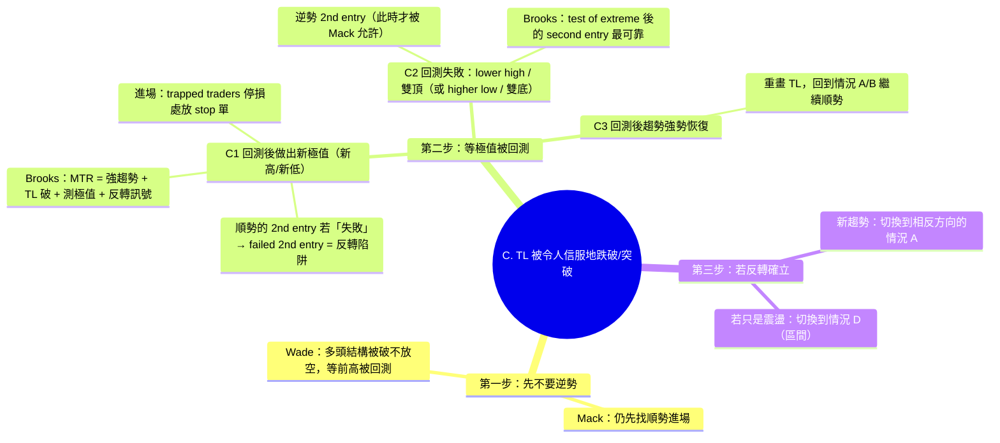
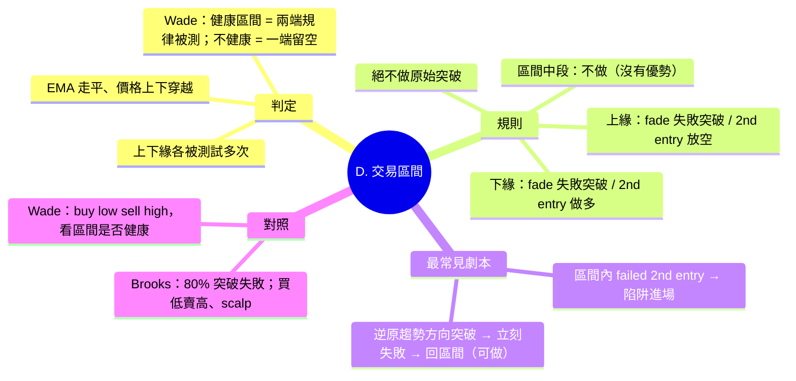
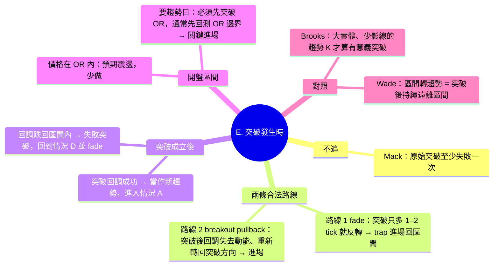
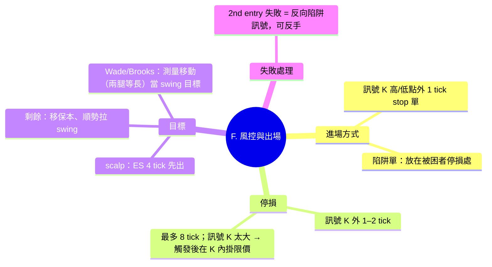

# 趨勢規則 × 各種情況路線心智圖（Mack PATs 為主，Al Brooks / Thomas Wade 對照）

> 以 Mack（priceactiontradingsystem.com，PATs）的規則為主幹，Al Brooks 與 Thomas Wade 作為交叉驗證。
> 內容依 2026-10 公開網頁查證整理，來源列在文末。僅供練習與覆盤使用，非投資建議。

---

## 0. 總圖：市場只會做三件事



**第一個問題永遠是：現在是趨勢還是區間？** 答案決定你走哪一條路線。

---

## 1. Mack 的核心規則清單（主幹）

| # | 規則 | 來源（Mack 原文要點） |
|---|---|---|
| 1 | 唯一指標是 **21 EMA**。EMA 像一條「會動的趨勢線」：上漲時是支撐、下跌時是壓力；EMA 走平 = 區間。 | How We Use An EMA |
| 2 | 趨勢中 **只做順勢**，進場靠回調：**兩腿回調（two-legged pullback）到 EMA 或趨勢線**是勝率最高的進場。 | Two Legged Corrections |
| 3 | **第二進場（2nd entry / H2 / L2）**：第一次嘗試回到趨勢方向失敗後，第二次再度轉向的那一刻才是真正的進場。 | Understanding Second Entries |
| 4 | 兩腿回調看起來像頭部／底部，是**陷阱**：它是延續型態，不是反轉。輸家在這裡逆勢，贏家在這裡順勢。 | Two Legged Corrections |
| 5 | **逆勢交易的前提**：先要有一條重要趨勢線被「令人信服」地突破（不是只穿過幾個 tick）。 | Counter Trend Trading – Road to Ruin |
| 6 | TL 被破之後**仍然先找順勢進場**；要等到前高（多頭）／前低（空頭）被**回測（retest of the extreme）**之後，才可以考慮逆勢。 | Counter Trend Trading |
| 7 | 新手與尚未穩定獲利者：**永遠不做逆勢**。 | Price Action Rules Warn Against Counter Trend |
| 8 | **失敗的第二進場（failed 2nd entry）**：出現在區間內，或 TL 被破後又做出新極值時，幾乎一定是陷阱，是進入「新趨勢」的最佳位置。 | Day Trade Failed Second Entries |
| 9 | 第二進場「失敗」的定義：在拿到 scalper's profit 之前，價格先反向突破任何一根前一根 K 的收盤一個 tick。 | Failed Second Entries |
| 10 | **區間規則一：絕不買／賣原始突破**。大多數區間突破至少會先失敗一次。 | How to Day Trade Break Outs |
| 11 | **區間規則二：要嘛 fade 突破（做失敗突破），要嘛等突破回調（breakout pullback）再進。** 回調失去動能、價格重新轉回突破方向時進場。 | How to Day Trade Break Outs |
| 12 | 區間內價格偏向延續進區間前的趨勢，但最常見的是**逆偏向方向突破後立刻失敗**。 | Failed Second Entries |
| 13 | **陷阱（trap）進場**：某個價位（小整理區、前一根 K 高低點）只多穿 1–2 tick 就立刻反轉；把 stop 單放在被困交易者會停損的位置，讓他們的停損把你掃進場。逆勢方向的失敗突破要特別警覺。 | Trading Traps in the ES |
| 14 | **停損**：訊號 K 外 1–2 tick，且離進場最多 8 tick（高波動時 8 tick 規則可放寬，改用「觸發後在訊號 K 內掛限價」）。 | Live Scalp Trades |
| 15 | **目標**：ES 常見 4 tick 先出一部分，其餘移到保本，看能不能走出更大的波段。 | Trading Traps / Live Scalp |
| 16 | 趨勢線至少要 3 個確認觸點才算「確認的趨勢線」；趨勢中幾乎都能把 TL 平移到另一側畫出**通道**。 | Using Trend Lines |
| 17 | **開盤區間**：價格還在開盤區間內就預期震盪；要有趨勢日必須先突破開盤區間，而且通常會先回測區間邊界，那是關鍵進場點。 | PATs 教材／社群整理 |

---

## 2. 路線心智圖：依「現在的情況」走

### 2.1 情況 A：強勢趨勢，趨勢線尚未被破



### 2.2 情況 B：趨勢變成通道（channel）



### 2.3 情況 C：趨勢線被有效突破（關鍵分岔）



### 2.4 情況 D：交易區間（橫盤）



### 2.5 情況 E：區間突破（含開盤區間）



### 2.6 情況 F：每一筆單的風險路線



---

## 3. 一頁式決策路線（文字版）

```
現在是趨勢還是區間？
├─ 趨勢（EMA 單側、HH/HL）
│   ├─ TL 未破 ──→ 只順勢：兩腿回調到 EMA/TL 的 2nd entry；絕不逆勢（A/B）
│   └─ TL 被有效破 ──→ 先不逆勢，等極值被回測（C）
│        ├─ 新極值 + failed 2nd entry → 反轉陷阱，進新趨勢
│        ├─ Lower high / 雙頂 + 逆勢 2nd entry → 反轉
│        └─ 強勢恢復 → 重畫 TL，回 A/B
└─ 區間（EMA 走平、兩端多次測試）
    ├─ 絕不追原始突破
    ├─ 上下緣：fade 失敗突破 / 2nd entry（D）
    └─ 突破發生 → fade 或等 breakout pullback（E）
         ├─ 回調成功 → 新趨勢 → A
         └─ 回區間 → 失敗突破 → D
```

---

## 4. 三位的差異（同一情況下）

| 情況 | Mack（主） | Al Brooks | Thomas Wade |
|---|---|---|---|
| 強趨勢 | 只順勢；兩腿回調到 21 EMA/TL 的 2nd entry；新手永不逆勢 | Spike 只順勢；窄通道不 fade；always-in 方向 | 結構確認後只做該方向；逆勢 2nd entry 視為 trap |
| TL 被破 | 先順勢，等前極值回測後才准逆勢 | MTR 四步：強趨勢→TL 破→測極值→反轉訊號 | 「趨勢線規則」：TL 破後會先做新極值再反轉；多頭破了不放空，等前高回測 |
| 反轉確認 | Failed 2nd entry（陷阱） | 測極值後的 second entry | 第一根反向 K 的高/低被突破 = failure |
| 區間 | 絕不做原始突破；fade 或等 breakout pullback；區間內 failed 2nd entry | 80% 突破失敗；買低賣高 scalp；等失敗再 fade | buy low sell high；先看區間是否「健康」 |
| 目標 | 4 tick scalp + 保本拉 swing | 測量移動；scalp 與 swing 分開 | 測量移動（兩腿等長） |
| 停損 | 訊號 K 外 1–2 tick，最多 8 tick | 訊號 K 外 | 訊號 K 外 |

---

## 5. 來源（2026-10 查證）

**Mack / PATs（priceactiontradingsystem.com）**
- Home: https://priceactiontradingsystem.com/
- How Two Legged Corrections Are Used In Price Action Trading: https://priceactiontradingsystem.com/how-two-legged-corrections-are-used-in-price-action-trading/
- Counter Trend Trading – The Road To Ruin: https://priceactiontradingsystem.com/counter-trend-trading-the-road-to-ruin/
- Price Action Trading Rules Warn Against Counter Trend Trading: https://priceactiontradingsystem.com/price-action-trading-rules-warn-against-counter-trend-trading/
- Using Price Action To Day Trade Failed Second Entries: https://priceactiontradingsystem.com/using-price-action-to-day-trade-failed-second-entries/
- How to Day Trade Break Outs: https://priceactiontradingsystem.com/how-to-day-trade-break-outs/
- Trading Traps in the ES – The Perfect Scalp Entry: https://priceactiontradingsystem.com/trading-traps-in-the-es-the-perfect-scalp-entry/
- Using Trend Lines To Help You Read The Price Action: https://priceactiontradingsystem.com/using-trend-lines-to-help-you-read-the-price-action/
- How We Use An EMA In Our Price Action Trading Strategies: https://priceactiontradingsystem.com/how-we-use-an-ema-in-our-price-action-trading-strategies/
- Watch Me Take Live Scalp Trades In The ES: https://priceactiontradingsystem.com/watch-me-take-live-scalp-trades-in-the-es-using-price-action-strategies/
- Understanding Second Entries: https://priceactiontradingsystem.com/understanding-second-entries-with-price-action-trading/
- 社群整理：https://quizlet.com/599525089/macks-price-action-trading-system-flash-cards/ 、https://futures.io/trading-journals/28040-price-action-mack-style.html 、https://evancarthey.com/pats-macks-price-action-day-trading-recommended/

**Al Brooks**
- Brooks Trading Course – 10 best price action patterns: https://www.brookstradingcourse.com/price-action/10-best-price-action-trading-patterns/
- Brooks Trading Course – Trading ranges: https://www.brookstradingcourse.com/how-to-trade-manual/trading-ranges/
- Brooks Trading Course – Trend channels: https://www.brookstradingcourse.com/futures-market/trade-trend-channels/
- Trasignal – 9 core principles: https://trasignal.com/blog/forex/price-action-trends-by-al-brooks/
- Trasignal – 2nd entry setup: https://trasignal.com/blog/learn/al-brooks-2nd-entry-setup/

**Thomas Wade**
- X：區間買低賣高 https://x.com/IamThomasWade/status/1973081597923475786
- X：failure / trap 定義 https://x.com/i/status/1916565654011838700
- User Guide – Thomas Wade Price Action Strategy: https://traidmarket.com/blogs/noticias/user-guide-thomas-wade-price-action-strategy
- 5 Price Action Rules EVERY Trader NEEDS To Know（影片逐字稿）: https://ytscribe.com/v/TegF3yYjnng
- Measured Moves and Two-Legged Pullbacks（影片逐字稿）: https://ytscribe.com/v/vHaDDLX9lOc
